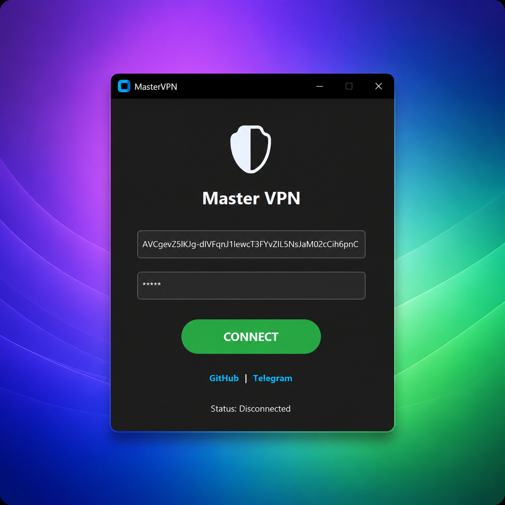

# 🛡️ MasterHttpRelayVPN (Windows)

در این پروژه تلاش شده است روش **MasterHttpRelay** به‌صورت یک اپلیکیشن نیتیو و بسیار ساده پیاده‌سازی و ارائه شود؛ به‌طوری‌که کاربران بدون نیاز به تنظیمات پیچیده یا دانش فنی خاص، بتوانند از قابلیت‌های آن بهره‌مند شوند.
پروژه MHR: [MasterHttpRelayVPN](https://github.com/masterking32/MasterHttpRelayVPN/)

> 🚀 ابزاری قدرتمند برای عبور از فیلترینگ و سیستم‌های **DPI (Deep Packet Inspection)**  
> با استفاده از تکنیک **Domain Fronting** — بدون نیاز به سرور یا تنظیمات پیچیده

✨ فقط با یک اکانت گوگل، به اینترنت آزاد متصل شوید

---

> [!WARNING]
> **توجه:** توصیه می‌شود برای راه‌اندازی و Deploy کردن Google Apps Script از یک اکانت Google جدا از اکانت اصلی استفاده کنید.  
> ممکن است برخی اکانت‌ها یا Deployment ID ها توسط Google محدود یا غیرفعال شوند.  
> اگر Deployment کار نکرد، با یک اکانت دیگر دوباره امتحان کنید.

---

## 📥 دانلود برنامه


برای استفاده از برنامه:

1. مخزن پروژه را به صورت ZIP دانلود کنید  
2. فایل ZIP را Extract کنید  
3. فایل `MasterVPN.exe` را اجرا کنید

👈 **[دانلود پروژه به صورت ZIP](https://github.com/AriPath/MasterVPN/archive/refs/heads/main.zip)**

---

## 🧠 سورس پروژه

این مخزن شامل **کد کامل پروژه** است:

- 🔧 بررسی و ویرایش پروژه
- 🛠 ساخت نسخه اختصاصی
- 🚀 اعمال تغییرات دلخواه

---

## ✨ قابلیت‌ها

- ⚙️ برنامه مستقل (`.exe`) بدون نیاز به Python  
- 🔐 تزریق خودکار Certificate  
- 🌐 استفاده از ترافیک Google برای دور زدن محدودیت‌ها  
- 🔄 تنظیم خودکار Proxy ویندوز  

---

## 🚀 راه‌اندازی سریع

### 👤 مراحل اجرا

🔧 وارد لینک دانلود شوید  
🔧 فایل را دریافت کنید  
🔧 برنامه `MasterVPN.exe` را اجرا کنید  
🔧 اطلاعات زیر را وارد کنید:
   - Google Script ID  
   - Auth Key  
🔧 روی کانکت کلیک کنید  

🎉 اتصال برقرار شد

---

## 📱 اتصال در تلگرام

1. Settings  
2. Advanced → Connection Type → Use custom proxy  
3. Add Proxy  
4. وارد کنید:

```text
Hostname: 127.0.0.1
Port: 8085
Type: HTTP
````

---
## 🛠 راه‌اندازی Google Apps Script

### مراحل

1. ورود به Google Apps Script  
https://script.google.com/

2. ایجاد یک پروژه جدید

3. حذف تمام کدهای پیش‌فرض

4. ایجاد یا جایگذاری فایل `Code.gs`

5. قرار دادن پسورد در خط زیر:
```javascript
const AUTH_KEY = "your_password_here";
```
🔧 تنظیم:

* Type: Web app
* Execute as: Me
* Access: Anyone

🔧 دریافت Deployment ID

---

## 🔗 اتصال

* Google Script ID = Deployment ID
* Auth Key = رمز شما

---

## 📄 License

MIT 
